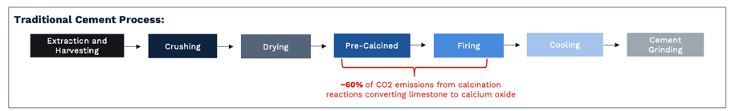
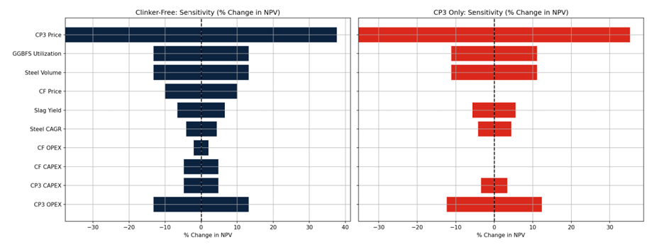
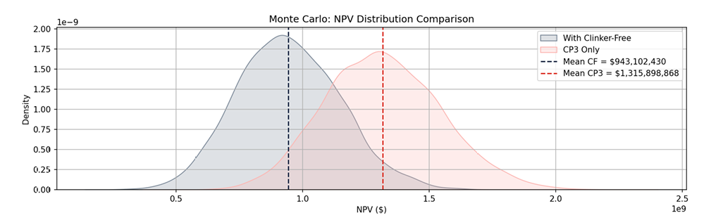

## Industrial-sustainability

# Project Context

This model was originally developed as part of a consulting project during my MSc at Imperial College London. The work was completed for an industrial steel producer evaluating potential strategies to valorise blast furnace slag through low-carbon cement production.

Due to confidentiality agreements, the specific company, location, and some underlying commercial data cannot be disclosed. The model included in this repository uses representative assumptions and simplified inputs to demonstrate the analytical framework used in the project.

# Problem Statement

Steel production generates large quantities of blast furnace slag as a by-product. This slag can be processed into ground granulated blast furnace slag (GGBFS), which can substitute clinker in cement production and significantly reduce CO₂ emissions.

The project assessed whether a steel producer should:

Produce CP3 cement using GGBFS as a clinker substitute, or

Invest in a new clinker-free cement technology requiring higher GGBFS utilisation.

The analysis evaluated the financial viability and emissions impact of these pathways under uncertainty in steel production, slag yield, cement prices, and carbon prices.

# Model Overview

The model links steel production, slag generation, and cement production to evaluate both financial and environmental outcomes.

Key components include:

• Slag availability based on steel production and slag yield
• Allocation of GGBFS between CP3 and clinker-free cement
• Financial modelling of cement production including CAPEX, OPEX, and carbon price impacts
• Monte Carlo simulation of key market and operational variables
• Sensitivity analysis to identify the main drivers of project value

The model outputs include project NPV distributions, sensitivity analysis, emissions reductions, and production trajectories.

## Sensitivity Analysis

## Monte Carlo Simulation

